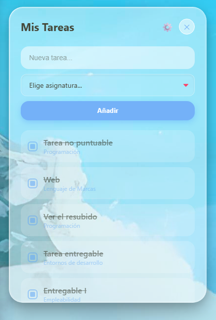
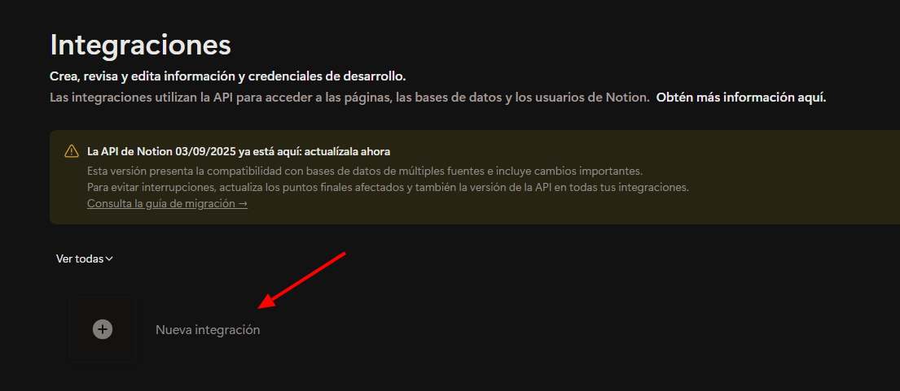
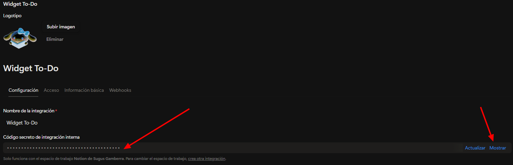
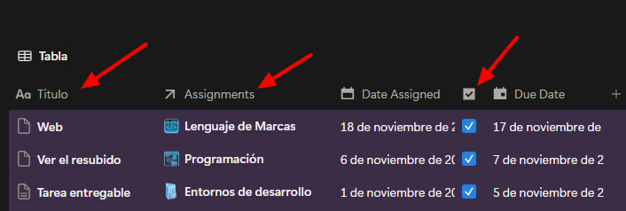
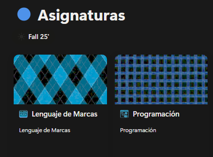
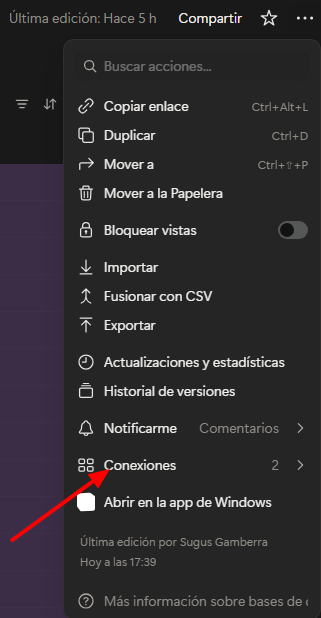

# ✨ Widget To-Do List (Notion Sync)

**Version**: 1.0.3 **Fecha**: 30/11/2025 **Autora**: SugusGamberra

---

  Un widget de escritorio flotante con estética <b>Soft / Glassmorphism</b> para gestionar tus tareas del curso (o de la vida) sincronizadas en tiempo real con Notion 🌸
    
  <b>Ya no necesitas tocar código! Instala, configura y disfruta ;3</b>

  

  
  
  

<i>Built with the tools and technologies:</i>

  
  
  
  
  
  
  
  
  

---

## 🚀 Características

- ✅ **Sincronización Bidireccional:** Lo que haces aquí, sale en Notion (y viceversa).
- 🎨 **Diseño Glassmorphism:** Fondo transparente y sombras suaves que quedan brutales con cualquier fondo!
- 🔗 **Asignación Inteligente:** Detecta tus asignaturas de Notion automáticamente.
- ⚙️ **Configuración Fácil:** Conectate a notion con el menú de ajustes integrado (olvídate de tocar archivos!).
- 🩺 **Always On:** Se queda en tu escritorio y recuerda su posición.

---

## 📥 Instalación (Para Usuarios)

1. Ve a la sección de **[Releases](../../releases)** de este repositorio (a la derecha).
2. Descarga el archivo `.exe` de la última versión (`Widget Tareas Setup.exe`).
3. Ejecútalo e instálalo en tu Windows.
4. **¡Listo!** Al abrirlo, verás un icono de engranaje ⚙️ para configurarlo.

---

## 🐙 SETUP (Configura tu Notion)

Para que el widget funcione con **TU** Notion, necesitas prepararlo una sola vez. ¡Es fácil!

### 1. Consigue tu Llave (Token) 🗝️
1. Entra en [Mis Integraciones de Notion](https://www.notion.so/profile/integrations).
2. Dale a `+ New Integration`.

3. Ponle un nombre (ej: "Mi Widget").
4. Dale a **Guardar**.
5. Copia el **"Código secreto de integracion interna"** (empieza por `secret_...`).

### 2. Prepara tus Tablas en Notion 📅
Necesitas dos bases de datos (Full Page). Si no las tienes, créalas:

**A. Base de Datos de TAREAS**
Asegúrate de que tenga EXACTAMENTE estas columnas:
* **`Titulo`** (Tipo: `Title`/Título) -> *Es la columna principal.*
* **`Done?`** (Tipo: `Checkbox`/Casilla) -> *Ojo con el signo de interrogación!*
* **`Assignments`** (Tipo: `Relation`/Relación) -> *Conéctala con la tabla de Asignaturas.*
* Si le quieres meter más cosas a la tabla como yo, cosa tuya, pero el widget no las reproducira (demomentos jiji)

**B. Base de Datos de ASIGNATURAS**
* **`Name`** (Tipo: `Title`/Título) -> *Aquí van los nombres (ej: Historia del arte, BBDD I, etc).*

### 3. ¡Dales permiso! (Súper Importante) 🤝
1. Ve a tu base de datos de **Tareas** en Notion.
2. Arriba a la derecha: **... (tres puntos)** > **Conexiones (Connections)** > Busca tu integración y añádela.

3. **Repite lo mismo** en la base de datos de **Asignaturas**.

### 4. Conecta el Widget 🔌
1. Abre el widget en tu escritorio.
2. Si es la primera vez, se abrirá el menú de configuración solo.
3. Pega tu **Token**, el ID de la base de **Tareas** y el ID de **Asignaturas**.
   *(El ID está en la URL de Notion, es el churro de números entre la `/` y el `?`).*
   *Ejemplo: `htttps://www.notion.so/ESTOS-NUMEROS-DE-AQUI?etc`*
4. Guarda y a disfrutar! ✨

---

## ✨ Contribuciones

Las contribuciones son bienvenidas! Sigue estos pasos:

1. 🍴 Forkea el repo
2. 🌟 Crea tu branch (`git checkout -b feature/AmazingFeature`)
3. ✅ Commitea tus cambios (`git commit -m 'Add some AmazingFeature'`)
4. 📤 Pushea a la branch (`git push origin feature/AmazingFeature`)
5. 🔃 Abre una Pull Request

## 🗒️ Licencia

This project is licensed under the MIT License - see the [LICENSE](./LICENSE.md) file for details.

## 🩵 Agradecimientos

- 🎨 **Inspiración del diseño**: Me ha pegado fuerte el estilo glassmorphism y quería algo que se sintiera parte del escritorio.
- Hecho con mucho 💖 y estrés de estudiante de DAW.

---
> *Espero que te guste y te inspire a hacer tu propio to-do list! Seguiré manteniendo actualizado esto hasta que tenga una versión competi jiji*